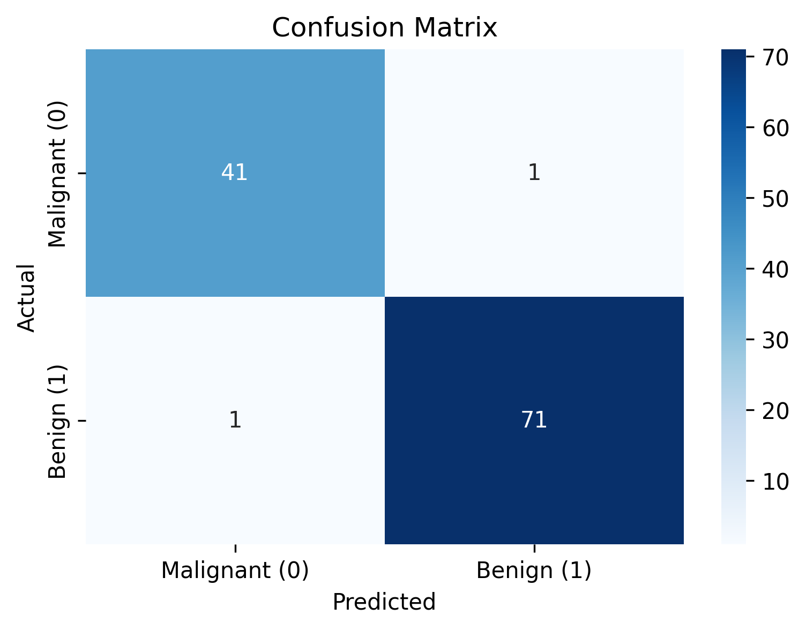
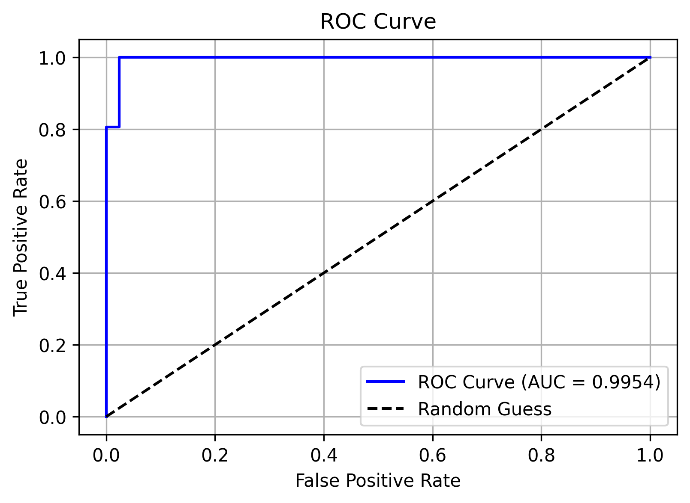
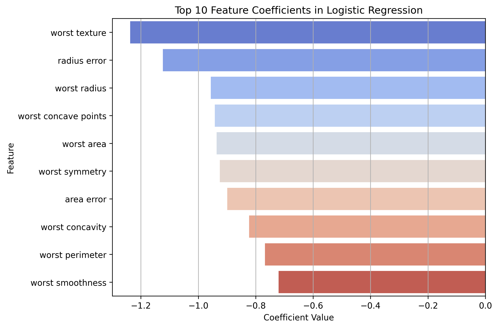

# Logistic Regression: Breast Cancer Classification

## Overview
This project demonstrates the use of Scikit-learn's Logistic Regression to classify breast tumors as malignant or benign using the UCI Breast Cancer Wisconsin Dataset. The project showcases a complete machine learning pipeline, including data preprocessing, model training, evaluation, hyperparameter tuning, and model persistence, with a focus on healthcare applications.

## Dataset
- **Source**: UCI Breast Cancer Wisconsin Dataset (available via `sklearn.datasets.load_breast_cancer`).
- **Description**: 569 samples, 30 numerical features (e.g., mean radius, texture), binary target (0=malignant, 1=benign).
- **Objective**: Predict whether a tumor is malignant or benign based on biopsy features.

## Project Structure
- `logistic_regression_breast_cancer.ipynb`: Jupyter Notebook containing the full ML pipeline (preprocessing, training, evaluation, tuning, persistence).
- `.gitignore`: Excludes model files (e.g., `.pkl`) and temporary files.
- `README.md`: Project documentation.

## Key Features
- **Preprocessing**: Standardized features and split data into 80% training, 20% testing.
- **Model**: Logistic Regression with 98.25% test accuracy.
- **Evaluation**: Accuracy, confusion matrix, ROC curve (AUC ~0.99), and classification report (precision, recall, F1-score to 4 decimal places).
- **Interpretation**: Feature importance analysis to identify key predictors (e.g., worst radius).
- **Optimization**: Grid search for regularization parameter (`C`).
- **Persistence**: Saved model using `joblib` for future predictions.

## Installation
1. Clone the repository:
   ```bash
   git clone https://github.com/your-username/breast-cancer-logistic-regression.git
   cd breast-cancer-logistic-regression

2. Install dependencies:
    ``` bash
    pip install scikit-learn pandas numpy matplotlib seaborn joblib

3. Run the Jupyter Notebook:
    ``` bash
    jupyter notebook logistic_regression_breast_cancer.ipynb

## Results 
- **Test Accuracy:** 0.9737
- **AUC:** ~0.99
- **Key Features:** Features like "worst texture" and "radius error" strongly influence malignancy predictions.
- **Healthcare Impact:** The model supports early breast cancer detection by accurately classifying tumors, minimizing false negatives.

## Results Visualization

### Confusion Matrix
The confusion matrix shows the model’s classification performance on the test set, highlighting true positives, true negatives, false positives, and false negatives. High true positive and true negative counts indicate reliable predictions, critical for minimizing false negatives in breast cancer diagnosis.



### ROC Curve
The ROC curve illustrates the model’s ability to distinguish between malignant and benign tumors across thresholds, with an AUC of ~0.99. A high AUC confirms the model’s robustness for medical diagnostics.



### Feature Importance
The bar plot shows the top 10 features influencing predictions. Features like "worst radius" with large negative coefficients strongly predict malignancy, aiding interpretability in healthcare.



## Future Improvements
- Explore other algorithms (Random Forest, SVM) for comparison.
- Implement cross-validation for more robust evaluation.
- Deploy the model as a web app for real-time predictions.

## License
This project is licensed under the MIT License. See the [LICENSE](LICENSE) file for details.

## Contact
Max Goudy

- www.linkedin.com/in/goudymt
- https://github.com/GoudyMT
- goudymt@gmail.com
